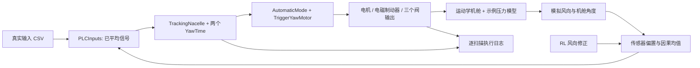

# PLC 自动偏航：来源、对应关系与建模边界

实现入口：[PLCYawEnv](../../WindGym/plc_yaw/env.py)、
[逐扫描控制器](../../WindGym/plc_yaw/controller.py)、
[运行说明](../../examples/plc_yaw/README.md)。

## 实现范围

依据 `automatic-yaw-control.md` 的正常自动跟踪范围：自动偏航、有效风、无 slip-yaw。
风消失、离开自动模式、上电检查和 `PAR_bNacelleOpenElectrical` 的停机路径也实现。
XML 中的冻雨、手动、紧急、解缆、台风、节能和安全扭缆程序**没有整体移植**。
`auto_mode=False` 表示退出至一个仅请求停止的状态，不是对所有其他模式的仿真。
`slip_yaw=True` 明确报错，避免把它当作正常自动偏航。

回放 CSV 时不连接运动学反馈；闭环 Gym 环境连接反馈。
机舱角度仅随物理电机输出变化。逻辑启动到物理启动之间不转动；
逻辑停止后的加压/延时阶段仍按物理输出继续转动。

## 参考文件的固定身份

| 文件 | SHA256 |
| --- | --- |
| `automatic-yaw-control.md` | `ba03469a949af13a67263a8682a54605514775f91b5a7ac8cdefb6036aa250fa` |
| `pcm51-yaw-control-reference.plcopen.xml` | `3583d5f5e305d4765fedfba76215c6b29aea528e86ebac7683bf921d374f2e05` |

XML 文件头标注 CODESYS V3.5 SP15 Patch 2；这不能证明现场部署版本。
附件中的操作指引仅作为附件内容处理，没有调用它提到的仓库脚本或执行 ST。

| XML 中的 POU 起始行 | Python 对应 | 核查重点 |
| --- | --- | --- |
| `PRG_TrackingNacelle`，8165 | `PLCYawController._track` | 阈值、快/慢/Standby/风回归请求、CCW 先执行、5 s 抑制 |
| `YawTime`，1453 | `YawTime.scan` | 上升沿采样、符号记忆、T/H、监督停止、延时停止、记忆复位 |
| `PRG_YawAutomaticMode`，910 | `PLCYawController.scan` | 10 s 门控、门控后上升沿、逻辑下降沿请求物理停止 |
| `PRG_TriggerYawMotor`，7183 | `MotorSequence.scan` | 输入保持、开闸、启动、22 s TP、三种停机方式、关闸 |
| `PRG_YawControl`，6008 | `PLCYawController.scan` | 先逻辑后执行、上一扫描自动标志、末尾上电停止请求 |
| `FB_CheckLimits`，5920 | `_track` 中的严格比较 | 大于/小于才触发，等于不触发 |
| `MAIN_ControlSubsystems_100ms`，2055 | `scan_ms=100` 假设 | 调用了 `PRG_YawControl`；XML 未给出 task 配置 |

## 已保留的执行细节

1. `T = min(round_ms(abs(theta30)/yaw_speed), 180°运行时间)`；
   `H` 独立计算并受 90°运行时间上限限制。它们从逻辑接受扫描计时。
   自动标志上升沿可以把 H 改为最大半偏航时间；不强行写成 `H=T/2`。
2. H 之前不因对准停止。监督阶段，正符号 `theta1 <= +1°`、负符号
   `theta1 >= -1°` 停止。延长阶段等号继续，严格跨入阈值内才停止；绝对超时优先。
3. 方向选择与 theta30 符号分别保存。风回归路径可以选择相反电机方向，
   对准判断仍使用原符号。外部模式仲裁不在附件中，本版可独立测试该跟踪分支，
   不保证仅用普通自动/停机模式就能产生所有现场风回归上下文。
4. 逻辑 5 s 抑制、物理停止 22 s TP、电机关闭后的可配置重启 TON 分别运行。
   电磁制动器关闭计时可与重启 TON 重叠。Standby 可绕过重启 TON，仍受 5 s 抑制。
   逻辑下降沿由跟踪程序在下一扫描检测，所以日志中的 5 s 抑制可能晚一拍。
5. 保留 POU 调用顺序、输入保持、同扫描多次调用不增加时间。
   物理输出下降时 YawTime 清空记忆，源码并未在该语句直接写 `bStartYaw=False`；
   因此记录中可能有一拍逻辑/物理输出不同步。

自动模式三个液压阀输出为 `1/0/1`，请求停止时为 `0/0/0`。
`DQ_NacelleOpenElectricalYawBrake=True` 是**开闸命令**，不是开闸反馈传感器。
合闸结束后命令变为 False。

停止方式 1 固定等待 1 s；方式 2 用风速时间；方式 3 用压力严格超过目标或安全超时。
方式 3 的额外 TP 保持“已达到停机条件”，避免压力回落中断合闸。
方式 2 保留 `REAL_TO_TIME(WindTime) * 1000` 的顺序：例如 11.5 先取整为 12，再成为 12 s。

阈值插值保留 XML 原来的 `MAX(value, low)` 然后 `MIN(value, high)`。
当配置 `low > high` 时，结果恒为 `high`；没有为了图表好看而交换上下界。
低/高风速相等时，保持源码的高风阈值回退并记录 `division_by_zero_14=True`。

## 参数表：都需要实际机组数值确认

源码硬编码且已保留：自动模式门控 **10 s**、逻辑抑制 **5 s**、停止脉冲 **22 s**、
对准边界 **±1°**、扭缆请求边界 **±270° / ±90°**、方式 1 的停止延时 **1 s**。
其余配置默认值都是示例，XML 不包含这些全局参数的实际赋值。

| Python 配置 | PLC 参数 | 示例值 |
| --- | --- | --- |
| `yaw_speed_deg_min` | `PAR_rYawSpeed_grdpermin` | 18 °/min |
| `reaction_low_deg` / `reaction_high_deg` | `PAR_rDiffYawTrackingSlowReaction` / `PAR_rDiffYawTrackingFastReaction` | 8° / 15° |
| `wind_low_mps` / `wind_high_mps` | `PAR_rMinWindForYawTracking` / `PAR_rMaxWindForYawTrecking` | 3 / 15 m/s |
| `restart_seconds` | `PAR_tYawDelayRestartMotors` | 30 s |
| `brake_open_seconds` | `PAR_tDelayOpenYawMotorBrake` | 2 s |
| `motor_start_seconds` | `PAR_tYawDelayStartMotors` | 1 s |
| `brake_close_seconds` | `PAR_tDelayCloseYawMotorBrake` | 1 s |
| `stop_mode` | `PAR_iAddPressureMode` | 1；支持 1/2/3 |
| `wind_time_enabled` | `WindTimeEnable` | True |
| `wind_time_constant` / `wind_time_min` / `wind_time_max` | `TIMECON` / `WindTimeMin` / `WindTimeMax` | 5 / 5 / 13 |
| `pressure_mode` | `PAR_iAddPressureMode_Pressure` | 1；支持 1/2/3/4 |
| `pressure_low` / `pressure_high` | `PAR_rAddPressureDown_input` / `PAR_rAddPressureUp_input` | 20 / 25，方式 4 才使用 |
| `pressure_wind_low` / `pressure_wind_high` | `PAR_rAddWindDown` / `PAR_rAddWindUp` | 5 / 15 m/s |
| `pressure_safety_seconds` | `PAR_tDelayStopYawMotorSafety` | 15 s |

压力模式 1/2/3 的目标下/上限直接按 ST 中的 40/90、30/75、25/50 设置。
压力保留原始工程数值，附件未注明单位，环境不擅自标成 bar 或 MPa。
初始化模式 0、不支持的枚举、零偏航速度、压力插值除零、无法在 22 s 内完成的
停止参数会明确拒绝；这些不是受验证的正常配置。

## 明确的仿真假设与实际限制

| 项目 | 本版处理 | 现场校准所需依据 |
| --- | --- | --- |
| 任务周期、数值精度 | 整数毫秒时钟，默认 100 ms；Python 浮点，正时间按最近毫秒取整，半值向上 | 任务配置、目标 CPU/CODESYS 类型转换表现 |
| TON/TP/边沿 | 参数与输入保持；TP 使用实时 PT；初始低电平不人为生成下降沿 | 实际 Standard 库版本，冷启动与 PT 修改测试录波 |
| 初始上下文 | 内部自动标志/输出为 False，默认选择自动模式；离开后再进入重置自动门控 | 外部 yaw-mode 仲裁、保持变量和冷/热启动值 |
| 风向测量 | 原始相对风向加固定偏置/噪声后，以因果圆周均值生成 1/30/300 s 信号；初值采用恒定前史 | 实际采样率、平均算法和原始传感器序列；CSV 可直接跳过该假设 |
| 机舱运动 | 输出 ON 时匀速，OFF 时停转；默认 0.3 °/s，可独立于控制器速度参数设置 | 接触器反馈、惯性、制动滑移、传动间隙和速度录波 |
| 液压反馈 | 阀打开时示例线性降压，阀关闭时线性升压，生成 1 s 压力均值 | 真实液压动态或已有压力输入录波 |
| 状态输入 | 有效风、Standby、启动偏差等作为外部布尔输入 | 相关状态码/模式仲裁逻辑 |
| 电缆扭转 | 随机舱转动积分；只用于所覆盖的风回归条件 | 解缆/限位/安全扭缆逻辑，未在本环境实现 |
| 功率与载荷 | 未实现；奖励只衡量偏差与动作成本 | 后续经校准的气动/载荷后端及评价数据 |

上电 30 秒在闭环示例中生成 `gbFirst30secAfterPLCStartOK`，回放时直接读取信号。
它在原程序中是**重复请求物理停止**，不是直接冻结逻辑定时器；实现保留这一点。
有效风短暂丢失时自动门控 FB 可能暂不被调用并保留状态，本环境按原调用路径处理，
不额外发明统一的“重启等待状态”。这些情况都应纳入目标运行时对照。

计时器通用语义参考 CODESYS 官方 [TON](https://content.helpme-codesys.com/en/libs/Standard/Current/Timer/TON.html)、
[TP](https://content.helpme-codesys.com/en/libs/Standard/Current/Timer/TP.html)、
[F_TRIG](https://content.helpme-codesys.com/en/libs/Standard/Current/Trigger/F_TRIG.html) 和
[REAL 类型转换](https://content.helpme-codesys.com/en/CODESYS%20Development%20System/_cds_operator_real_to.html)。
这些在线说明与附件声明的特定旧版本仍可能有差别；没有把文档测试当作现场一致性证明。
